# Redes Virtuales en Azure

En esta práctica vamos a crear una red virtual en Azure y dos máquinas virtuales, un Windows Server 2019 y un Windows 10 Pro, y probaremos y a conectar.

Los pasos para dar respueta a la siguiente necesidad:

## Paso 1

Crearemos nuestro grupo de recursos.

Para ello nos vamos al menú principal de Azure y seleccionaremos grupo de recursos y dentro de este pulsaremos create.

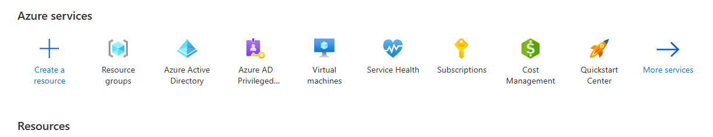

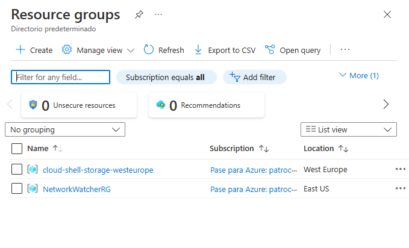

Le daremos el nombre de RG-vnet3.

## Paso 2

Crearemos una máquina virtual con Windows Server 2019, dentro del grupo de recursos pulsaremos el boton create, y seleccionamos windows Server 2019 Datacenter y empezaremos la creación.

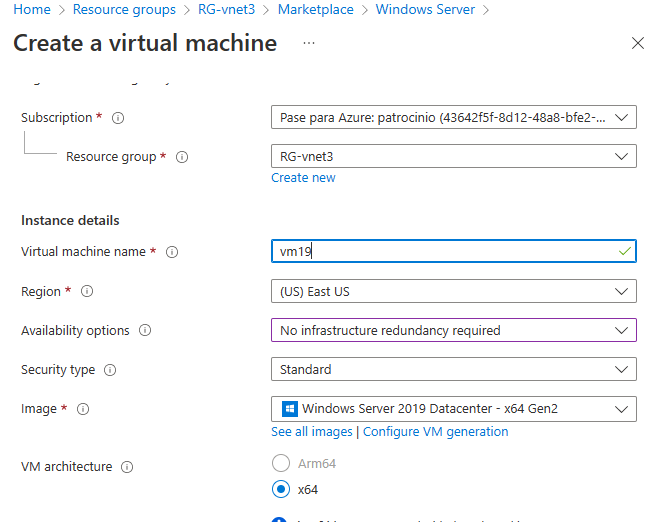

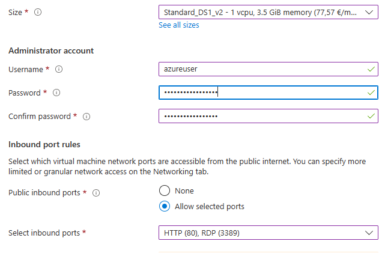

Lo primero seria elegir, la suscripción despues el nombre de la máquina en este caso vm19, la arquitectura x64.

El nombre de usuario en este caso azureuser y muy importante abrir los puertos HTTP y RDP.

Los discos los dejamos por defecto.

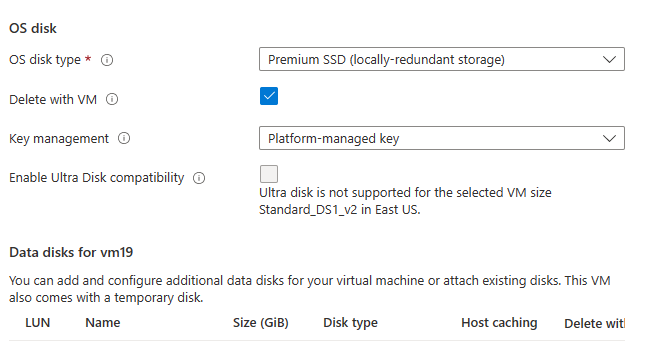

Ahora configuraremos la Red Virtual.

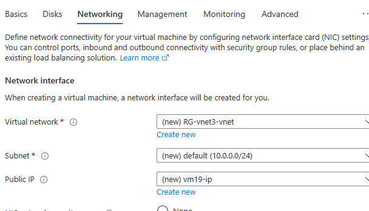

En este paso daremos en crear nueva, para crear una nueva Red Virtual.

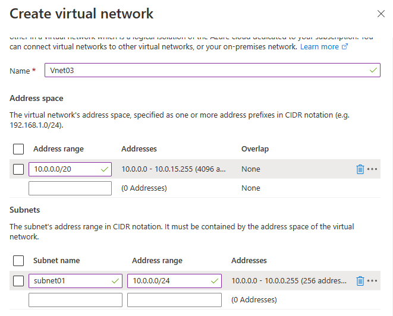

Elegimos el nombre Vnet03, elegimos el rango de la red 10.0.0.0/20 y creamos la subred subnet 01, con el rango 10.0.0.0/24.

Pasaremos a la creacion de la IP Pública, en la pestaña de Networking, en el apartado de IP Pública seleccionaremos crear nueva.

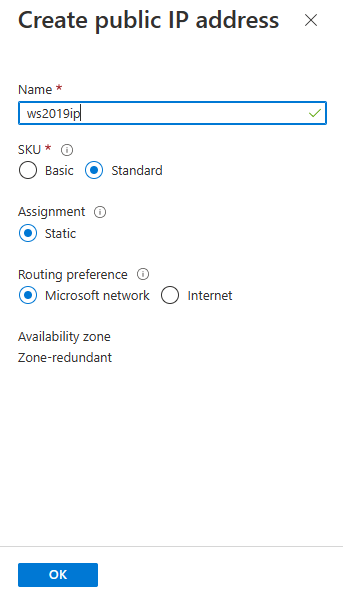

Le pondremos el nombre ws2019ip, SKU en standard, Asignamiento Estático y ruta de preferencia Microsoft Network.

En la pestaña Tags asignaremos esta máquina al departamento de Marketing.

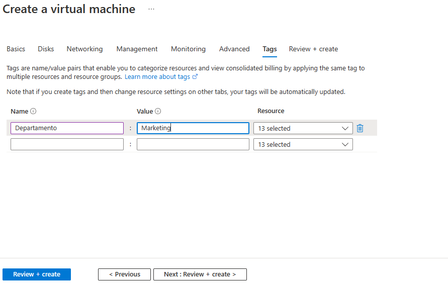

Pulsaremos Revisar y Crear.

Una vez pulsado eso nos saldrá la siguiente ventana.

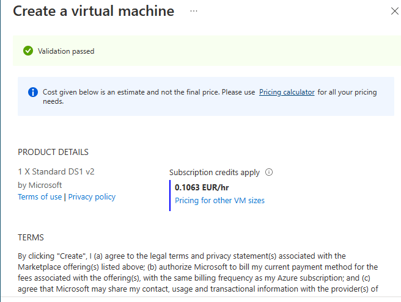

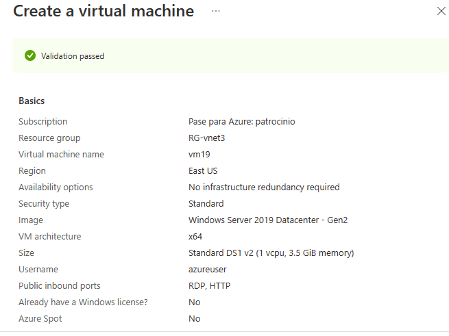

Despues de esto pulsamos create y empezará el proceso.

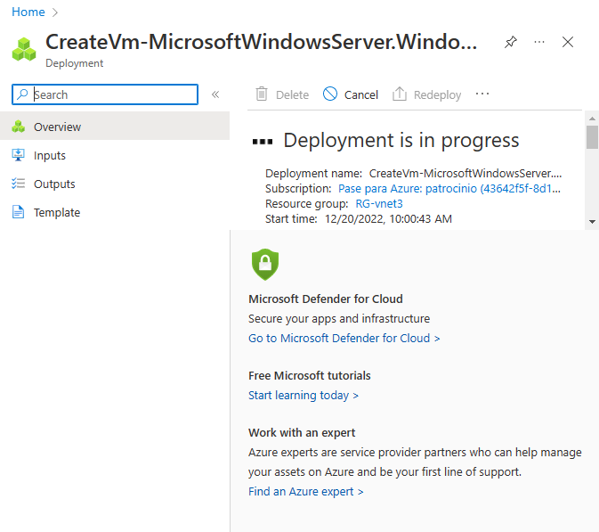

Una vez acabado el proceso, nos aparecerá en el grupo de recursos.

## Paso3

Crearemos una Máquina Virtual con el SO Windows 10 Pro.

En el Grupo de Recursos pulsaremos el boton Create.

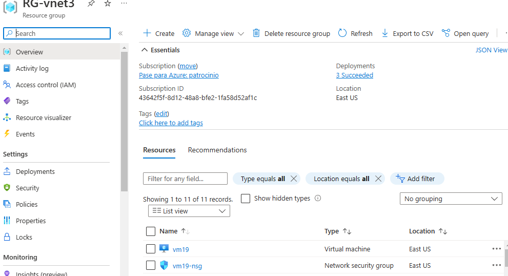

Seleccionamos Windows 10 y pulsamos el create, nos aparecerá la siguiente ventana.

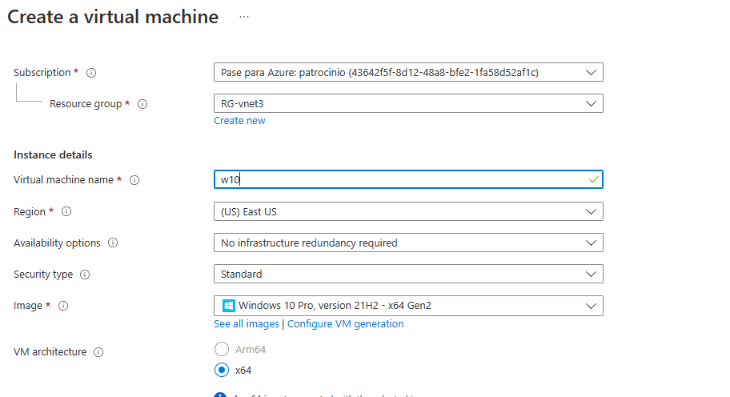

Como en el anterior estbleceremos el nombre, la arquitectura y lo meteremos en el grupo de recursos previamente creado.

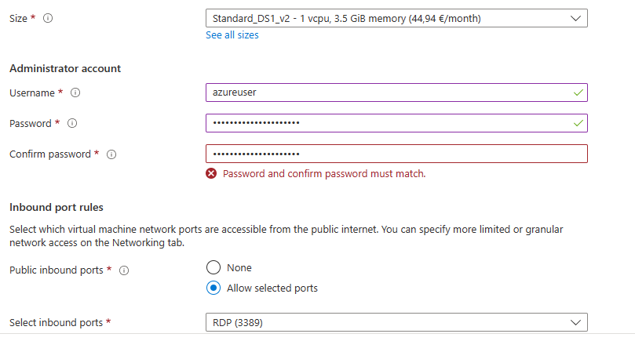

Creamos el usuario, y abrimos el puerto RDP, Ahora vamos a configurar la pestaña de Networking.

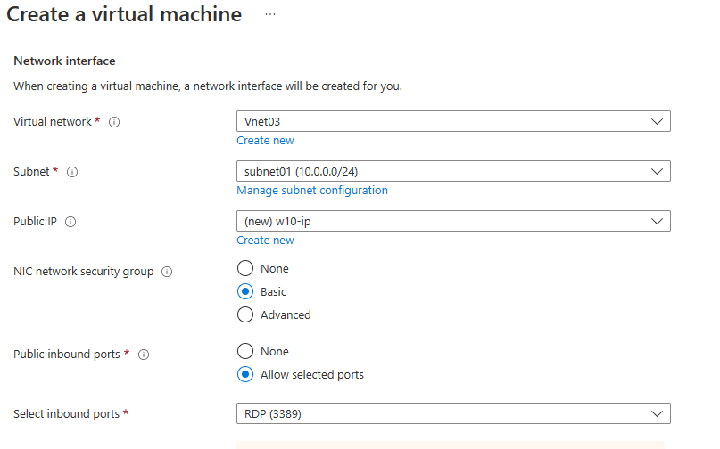

Configuraremos esta máquina para que este en la red virtual creada previamente, y en la misma subnet. Otra vez comprobaremos que el puerto RDP esta abierto.

Ahora configuraremos la IP Pública, crearemos una nueva IP Pública.

En la pestaña tags, también asignaremos esta máquina al departameto de Márketing.

Presionaremos Revisar+Crear y empezará el proceso de creación de la máquina una vez acabe aparecerá en el grupo de Recursos.

