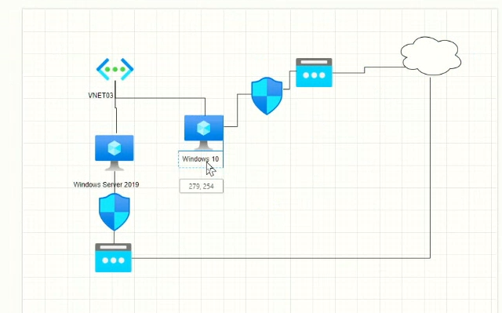

# Redes Virtuales en Azure

En esta práctica vamos a crear una red virtual en Azure y dos máquinas virtuales, un Windows Server 2019 y un Windows 10 Pro, y probaremos y a conectar.

Los pasos para dar respueta a la siguiente necesidad:

