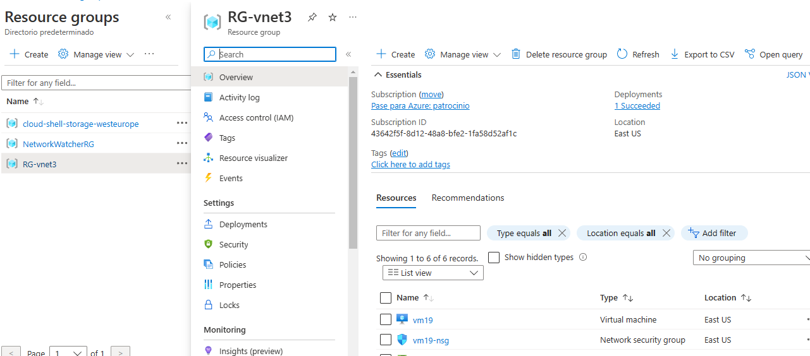
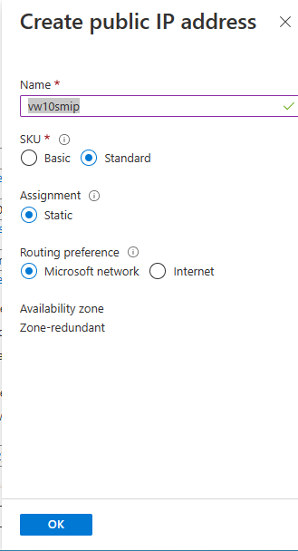
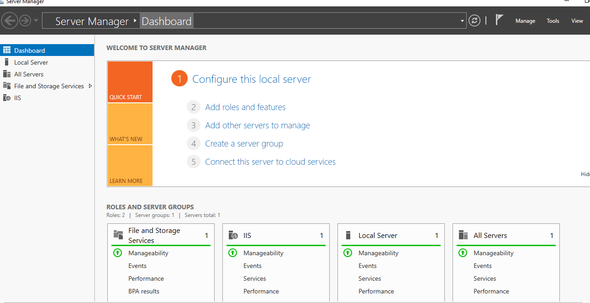
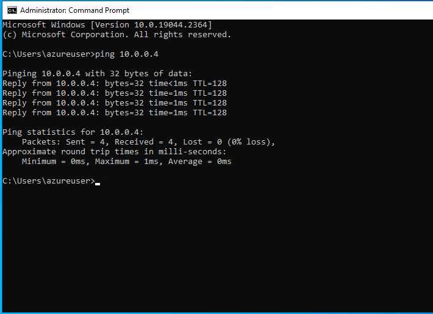
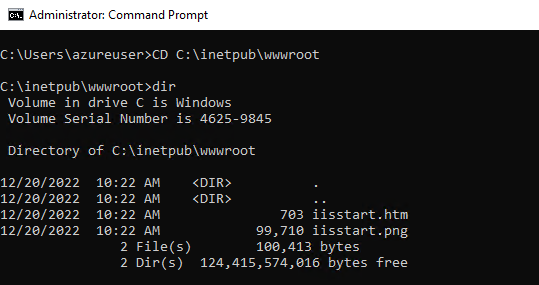

# Redes Virtuales en Azure

En esta práctica vamos a crear una red virtual en Azure y dos máquinas virtuales, un Windows Server 2019 y un Windows 10 Pro, y probaremos y a conectar.

Los pasos para dar respueta a la siguiente necesidad:

## Paso 1

Crearemos nuestro grupo de recursos.

Para ello nos vamos al menú principal de Azure y seleccionaremos grupo de recursos y dentro de este pulsaremos create.

Le daremos el nombre de RG-vnet3.

## Paso 2

Crearemos una máquina virtual con Windows Server 2019, dentro del grupo de recursos pulsaremos el boton create, y seleccionamos windows Server 2019 Datacenter y empezaremos la creación.

Lo primero seria elegir, la suscripción despues el nombre de la máquina en este caso vm19, la arquitectura x64.

El nombre de usuario en este caso azureuser y muy importante abrir los puertos HTTP y RDP.

Los discos los dejamos por defecto.

Ahora configuraremos la Red Virtual.

En este paso daremos en crear nueva, para crear una nueva Red Virtual.

Elegimos el nombre Vnet03, elegimos el rango de la red 10.0.0.0/20 y creamos la subred subnet 01, con el rango 10.0.0.0/24.

Pasaremos a la creacion de la IP Pública, en la pestaña de Networking, en el apartado de IP Pública seleccionaremos crear nueva.

Le pondremos el nombre ws2019ip, SKU en standard, Asignamiento Estático y ruta de preferencia Microsoft Network.

En la pestaña Tags asignaremos esta máquina al departamento de Marketing.

Pulsaremos Revisar y Crear.

Una vez pulsado eso nos saldrá la siguiente ventana.

Despues de esto pulsamos create y empezará el proceso.

Una vez acabado el proceso, nos aparecerá en el grupo de recursos.

## Paso3

Crearemos una Máquina Virtual con el SO Windows 10 Pro.

En el Grupo de Recursos pulsaremos el boton Create.

Seleccionamos Windows 10 y pulsamos el create, nos aparecerá la siguiente ventana.

Como en el anterior estbleceremos el nombre, la arquitectura y lo meteremos en el grupo de recursos previamente creado.

Creamos el usuario, y abrimos el puerto RDP, Ahora vamos a configurar la pestaña de Networking.

Configuraremos esta máquina para que este en la red virtual creada previamente, y en la misma subnet. Otra vez comprobaremos que el puerto RDP esta abierto.

Ahora configuraremos la IP Pública, crearemos una nueva IP Pública.

En la pestaña tags, también asignaremos esta máquina al departameto de Márketing.

Presionaremos Revisar+Crear y empezará el proceso de creación de la máquina una vez acabe aparecerá en el grupo de Recursos.

## Paso 4

En este caso vamos a habilitar un rol de servicio Web en el Windows Server 2019 y vamos a probar a entrar tanto por la IP de la Red Virtual desde la máquina de Windows 10 como por la IP Pública desde mi propio PC.

### Arrancamos las máquinas.

En nuestro grupo de recursos elegimos nuestras máquinas y le damos a start.

Ahora nos conectaremos desde nuestro PC abriremos un Remoto y nos conectaremos.

Ponemos la dirección IP Pública del windows Server y la password que pusimos y y ya estaremos dentro.

Haremos lo mismo con el windows 10.

### Istalamos rol de Web Server IIS en Windows Server 2019

Para esto nos vamos al server manager en manage pulsamos Add Roles and Features.

Continuaremos el proceso por defecto hasta llegar a la siguiente pantalla.

Seleccionaremos el Web Server IIS y pulsaremos instalar, una vez acabe el proceso ya nos aparecerá instalado.

Antes de continuar comprobaremos que tanto WIndows Server 2019 como Wondows 10 se "ven" dentro de la red, para ello haremos ping en el cmd de una a otra.

Ping desde windows Server a Windows 10.

Ping desde Windows 10 a Windows Server.

Como podemos comprobar todo correcto.

### Configuramos la página de inicio en Windows Server.

Primero veremos la página de inicio desde la máquina de windows 10, para ello pondremos en el navegador la dirección IP del Server en en este caso 10.0.0.4.

Ahora vamos a configurarlo. En cmd pondremos el siguiente comando:

CD C:\inetpub\wwwroot

Una vez dentro de este directorio comprobamos el nombre del archivo.

Ejecutaremos el comando:

notepad iisstart.htm

Nos abrirá un bloc de notas en html como este.

Editamos la configuració para que nos diga Web de Rafael Román.

Probaremos desde mi PC, para ello pondremos la dirección IP Pública de la Máquina de Windows Server en nuestro navegador.

Una vez hecho esto pararemos las máquinas para que no nos suponga un gasto demasiado grande.

## Paso 5 

### Control de gasto

Hemos gastado 2USD
